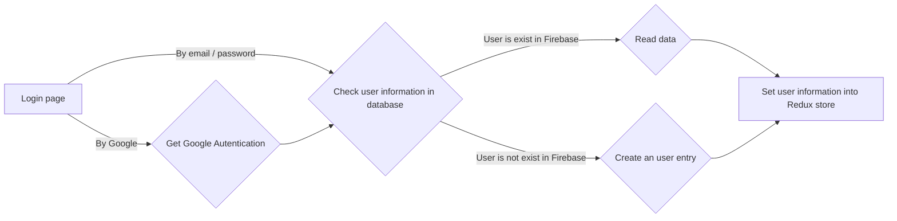

# LinkedIn clone (React, Firebase, Node JS)

  

  

This nice **React / Redux** application is a clone of basic LinkedIn webapp, but it's independent from that. The webapp doesn't collect any sensitive information and uses no Cookies.
The information that is stored are:
 - Login information: 
	 - After login by Google authentication:
		 - uid: Firebase generates this random uid after authenticating
		 - displayName: name of the user, provided by Google Authentication API
		 - email: email address of the user, provided by Google Authentication API
		 - photoURL: avatar photo of the user, provided by Google Authentication API
		 - emailVerified: this functional flag will be true, as it's authenticated by Google
	 - after sing up by email/password:
		 - uid: Firebase generates this random uid after authenticating
		 - email
		 - password
		 - emailVerified: this flag is false after registration, sending verification email is not planned in this demo to integrate

## Demo

Click [here](https://linkedin-clone-app-2516d.web.app) to view the demo webapp. Don't worry if Firebase shows it's a dangerous site, it's not! I am still working on to eliminate this message, probably this is a Google Chrome security block. But I can declare that the app doesn't gather sensitive information, it's a simple portfolio item on my own.

# About the solution

This project was bootstrapped with [Create React App](https://github.com/facebook/create-react-app).

  

## Available Scripts

  

To initialize the project the following commands should run:

    npx create-react-app linkedin-clone
    npm install
    firebase login
    firebase init
    npm run build
    firebase deploy

To begin the development, run `npm start` or `yarn start`, that runs the app in the development mode.
To create a production bundle, use `npm run build` or `yarn build`.

Open [http://localhost:3000](http://localhost:3000) to view it in your browser.

 The page will reload when you make changes.

You may also see any lint errors in the console.

`npm run build` builds the app for production to the `build` folder.

It correctly bundles React in production mode and optimizes the build for the best performance.

The build is minified and the filenames include the hashes.

Your app is ready to be deployed!

## Important links:

 - https://styled-components.com/
 -  https://redux.js.org/introduction/getting-started
 - https://www.npmjs.com/package/firebase-tools
 - https://react-redux.js.org/
 - https://redux-toolkit.js.org/
 - https://www.npmjs.com/package/emoji-mart
 - https://github.com/reduxjs/redux-thunk (for creating middleware)
 - https://www.npmjs.com/package/react-moment
 - https://www.youtube.com/watch?v=xP3cxbDUtrc
 - https://stackedit.io/app
 - https://www.manypixels.co/gallery (Licence of used SVG images)

## Eject the app
If you aren't satisfied with the build tool and configuration choices, you can `eject` at any time. This command will remove the single build dependency from your project.

`npm run eject`

 > Note: this is a one-way operation. Once you `eject`, you can't go back!

Instead, it will copy all the configuration files and the transitive dependencies (webpack, Babel, ESLint, etc) right into your project so you have full control over them. All of the commands except `eject` will still work, but they will point to the copied scripts so you can tweak them. At this point you're on your own.

You don't have to ever use `eject`. The curated feature set is suitable for small and middle deployments, and you shouldn't feel obligated to use this feature. However we understand that this tool wouldn't be useful if you couldn't customize it when you are ready for it.

  

# Structure of Firebase database
> **user** collection is for storing user related data

  |         user       |                          |                         
|----------------|-------------------------------|
|uid|`string`|
|about|`string`|
|birthday|`date`|
|displayName|`string`|
|email|`string`|
|location|`string`|
|photoURL|`string`|
|teaserImage|`string`|
|username|`string`|
|emailVerified|`boolean`|
|phoneNumber|`string`|
|shorturl|`string`|

> **posts** collection is for storing posts related data This is just a demo app, so I store some user related info to the post here, instead of making connection to user table (as in the demo may the initial posts have no connected user) 
> 
|         posts       |                          |                         
|----------------|-------------------------------|
|uid|`string`|
|displayName|`string`|
|username|`string`|
|verified|`boolean`|
|timestamp|`timestamp`|
|text|`string`|
|avatar|`string`|
|comments|`string`|
|numComments|`number`|
|reposts|`number`|
|likes|`array`|

> **post-comments** collection is for storing posts related comments

|         post-comments       |                          |                         
|----------------|-------------------------------|
|postid|`string`|
|uid|`string`|
|avatar|`string`|
|displayName|`string`|
|userlink|`string`|
|timestamp|`timestamp`|
|text|`string`|
|comments|`string`|
|likes|`array`|

> **post-images** collection is for storing posts related images

|         post-images       |                          |                         
|----------------|-------------------------------|
|imgUrl|`string`|
|postRef|`string`|

## Login diagram

